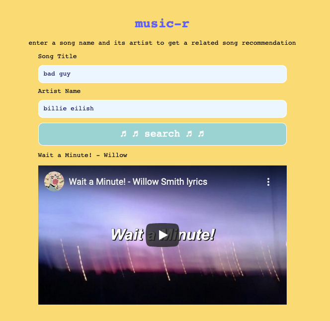
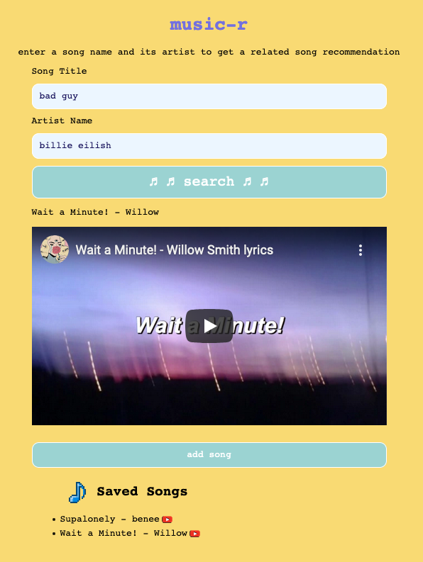

# Music-R

Music-R is a single-page vanilla Javascript application with a Rails API backend. In addition to the Rails API, Music-R makes use of the last.fm API and the Youtube API. You can view the backend repository [here](https://github.com/alliecaton/jsmusicrandomizer-backend)

Music-R is available for use [here](http://plausible-nest.surge.sh/).

## Usage

Enter a song name and its artist to receive a new song recommendation based on the track you entered. 

Create a username to keep track of songs you like! 

## License
[MIT](https://choosealicense.com/licenses/mit/)